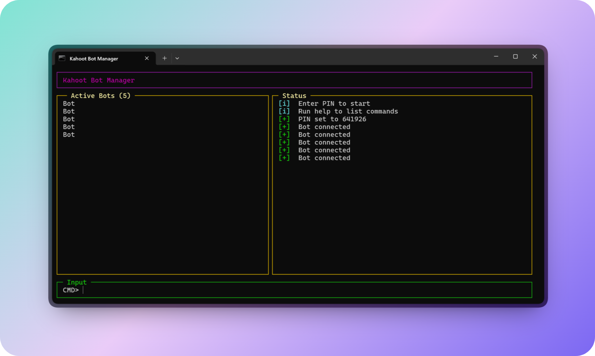

# Kahoot Bot

### Features

- Flood Kahoots with bots named whatever you want
- Join multiple bots with the exact same name
- Manage different bots individually
- Instant random answers

### Setup

1. Clone the repository

```bash
git clone https://github.com/Jones8683/Kahoot-Bot
```

2. Install dependencies

```bash
npm install
```

### Run

```bash
npm start
```

### Commands

| Command              | Description                                    |
| -------------------- | ---------------------------------------------- |
| `pin <pin>`          | Set the game PIN to connect to the Kahoot quiz |
| `add <name>`         | Add a single bot to the game                   |
| `add <name>*<count>` | Add multiple bots with sequential names        |
| `add <name>~<count>` | Add multiple bots with exact duplicate names   |
| `kick <name>`        | Remove a specific bot from the game            |
| `kick all`           | Remove all bots at once                        |
| `help`               | Show available commands                        |
| `exit`               | Quit the program                               |


